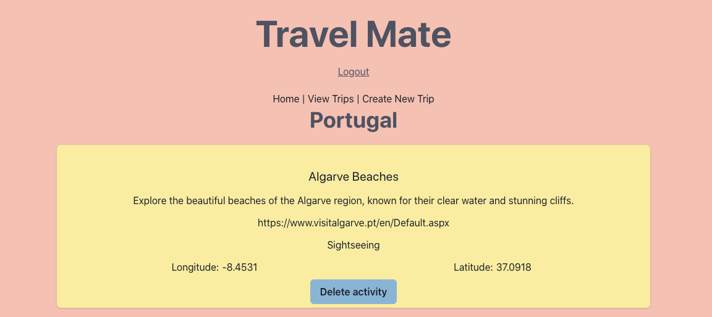
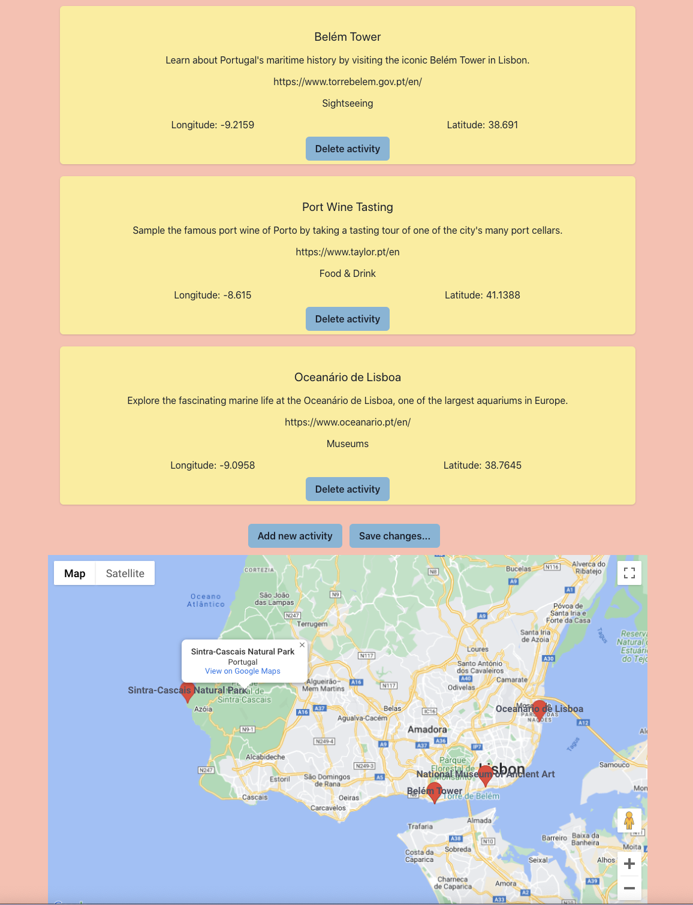
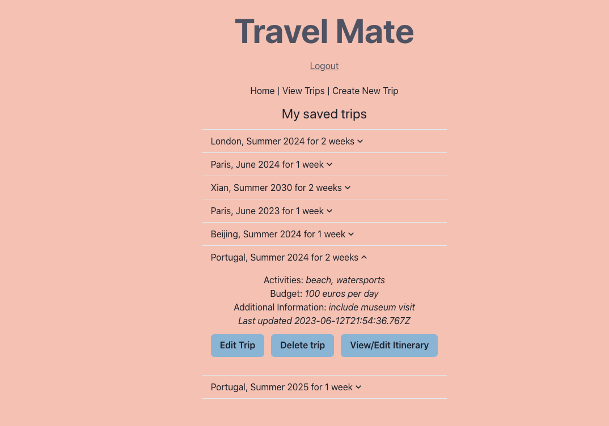
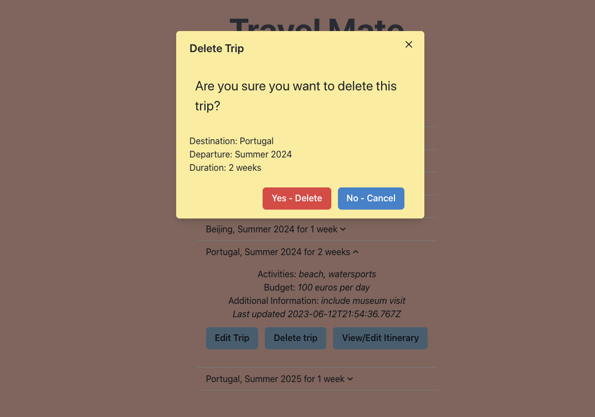
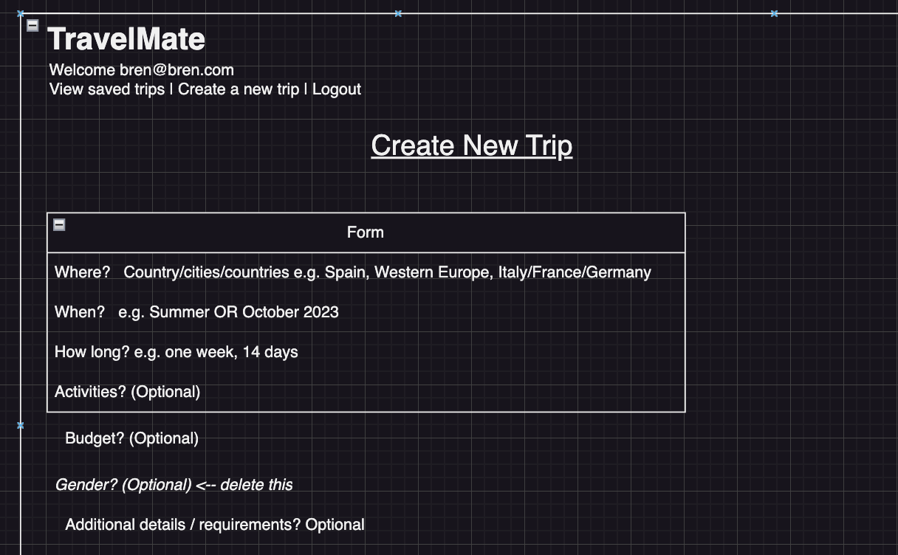
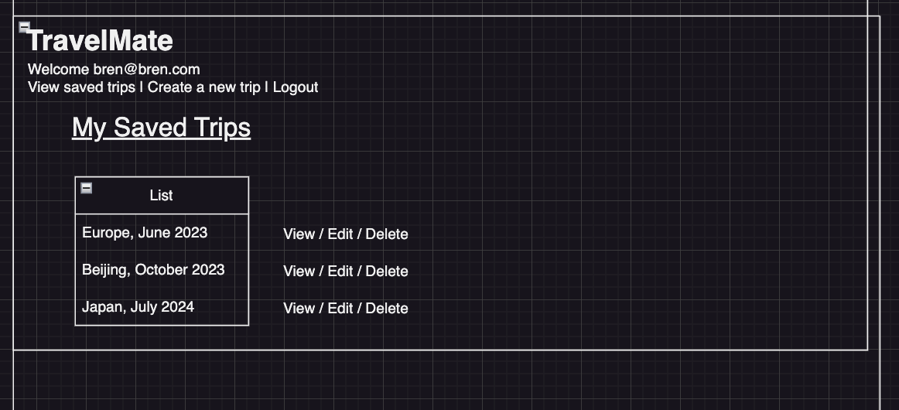
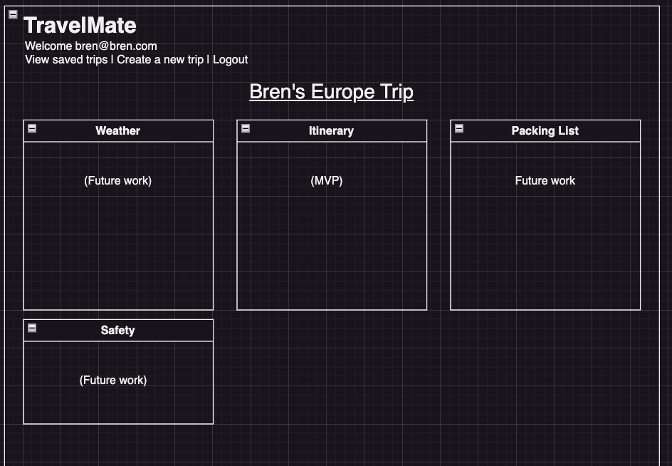

# travel-mate
Project 4 for General Assembly Software Engineering Immersive 

## Introduction
Travel Mate is an AI powered travel planning tool, designed to help users get the most out of their travel plans 
by suggesting ideas for trip itineraries. Travel Mate allows users to add their own ideas alongside those of the AI, with full create, edit and delete functionality. 

## User stories
As I user of travel-mate, I want:
* To quickly and easily add, edit and delete trips
* The ability to store multiple trips
* To have trip ideas automatically generated / suggested, but also the ability to add my own ideas and remove ideas I'm not interested in
* To be able to specify aspects like my budget, my interests, the time of year, trip duration, and to recieve personalised suggestions that take this into account
* To be able to specify multiple cities and countries in one trip, if preferred
* To see the ideas on a map to help visualise distance between and logistics of getting from one activity to the next
* To view website links for each activity to obtain more detailed information, book tickets, etc
* Colour scheme that suits the holiday vibe

## Approach  
From the user stores I wanted to allow for flexible input using natural langauge, whilst also providing users with some guidance by asking relevant questions (e.g. budget, time of year, trip duration) to ensure the user got the most relevant trip ideas. For this reason, it made sense to use a large language model such as ChatGPT that could handle open ended queries while still providing consistent structured responses (in JSON format) that could be rendered as a list and displayed on a map. By experimenting with different query formats, and using as JSON schema, I was able to find a response that consistently gave the required data (title, description, website URL, longitude/latitude) in a consistent JSON object. 

## Technologies used
* Server: Node Express 
* Database: Postgresql 
* Front end: React + React-router
* Front end build tool: Vite 
* React component library: Chakra-ui
* API: Open AI ChatGPT API for automatic itinerary generation
* AEV library for JSON validation
* Integration with Google Maps using @react-google-maps/api 
* Testing done using Jest and Babel

## Installation / setup 
* **git clone** the repo
* run **npm i** to install any required dependancies
* run **nodemon** in the server directory to run the back-end server
* run **npm run dev** in the client directory to run vite in dev mode to run app locally

## Screenshots
 
 
 
 

## Wireframes
The below ideas were generated during the initial stages to help visualise what form travel-mate could take. Page layouts were then developed further during development and testing.
 
 
 

## Unsolved problems / future work
Due to time limitations, the below features have not yet been implemented. Future versions of Travel Mate may include:
* Include relevant images of travel destinations (e.g. using the Unsplash API) 
* Ability to share trips with friends
* Other travel planning features like automatic generation of packing lists, weather forecasts, safety/security advice
* Budget tracking features
* Day by day trip planning
* Enable refresh of trip itinerary ideas from API when trip is edited (while still retaining any user added trip ideas)
* General improvements to UI (e.g. provide feedback using Chakra toast on events like form submission)